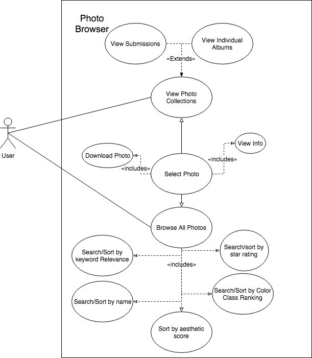

# Use Case Diagrams for Reynolds Journalism Institute 
### Group 1
 

## User File Management 

**Description:** This Use Case involves a user taking one or more photographs they would like to submit for review and uploading them to the image description database. The database must have enough storage space to accommodate the chosen files, and the chosen files must be pictures. Uploaded pictures will be displayed back to the user prior to rating. Note: this action does not mean the pictures will be graded immediately after, only that they exist on the database to be graded. In addition to upload, users can download images that have been graded to the database management system; the download process has fewer controls than the upload process and must be done with greater caution. Finally, a user can choose to delete files from the database. Our assumption is that this is not a public use system, but is being used by a small amount of users in charge of processing the images, otherwise security controls should be placed on user’s abilities to view, upload, and delete images.

**Triggers:** This use case begins when a user desires to either upload, download, or delete files from the system.
Actors: There is one actor, whoever is managing the files at the time. This may or may not be the photographer that originally took the pictures.

**Preconditions:** There must be enough room on the database to contain the desired images if the user wishes to upload.

**Main Success Scenario:** If the images are successfully uploaded, the user will be able to navigate a gallery of their uploaded photos and move on to the image evaluation portion of the program. 

**Alternate Success Scenarios:** In an upload, if one or more images are incompatible with the database, the remaining images should still be uploaded, with the database providing a report on which images could not be uploaded. In addition, the database could have enough reserved storage space for some, but not all, of the desired images, in which case the user should be informed and allowed to either cancel the upload or narrow the upload.
Failed End Condition: If there is no space for any images, or none of the desired files are compatible, then the upload cannot be completed. If no chosen files are compatible, the system will alert the user as to what file types are acceptable.

**Steps of Execution:** The user should have one or more files they would like to upload to the system. The desired files should exist on an external storage system connected to the hardware the program is running on. The user will utilize a menu provided by the program to select one or more images or directories to attempt to upload. The program will examine each of the selected files to make sure they are compatible, then compare the total size of the desired files to the remaining reserved storage space. If one or more of the files are not compatible, the program will stop, provide a report, and ask the user they would like to continue; otherwise, the program will continue. If there is not enough reserved storage space, the program will stop and give the user the opportunity to either cancel the upload or narrow down the number of desired images to upload. If the desired process is download, the user will select one or more images on the system they would like to save to a personal storage device. The images will be copied onto the storage medium for the user to access later. If the deletion operation is selected, the chosen files will be removed from the system.

***Created by:*** John Anderson

***Reviewed/Edited by:*** Chase Alexander, Allan Guthrie, Gavin Lee

 

## Photo Browser

**Description:** This use case is about what will happen when the user decided to browse photos in the database. They will have the option to view specific collections of photos, or browse the whole database of photos. While browsing the whole database they can search by keyword, star rating, color class ranking, aesthetic score, or name. The user can also sort the photos by the same criteria if they’d like. The user can from there select a photo and either download it, or view information on the photo. This will require a connection to a database of photos (predetermined).

**Triggers:** This use case starts once the user accesses the database of photos. They are given the options to view determined collections or more generally browse.

**Actors:** User

**Preconditions:** A database of photos.

**Main Success Scenario:** The user is able to find relevant photos to their query, whether just browsing or looking for something more specific.

**Alternate Success Condition:** The user doesn’t find the photo they’re looking for, but they find similar relevant photos.

**Failed End Condition:** Despite the photo they are looking for being in the database, the user could not find it using the tools provided.

**Steps of Execution:** User opens up the photo database. User accesses existing collections or user browses photos in database. If user browses photos in database they can choose to sort or search by keyword, name, Color Class Ranking, aesthetic score, or star rating, but if they chose to access existing collections they can choose between viewing uploads by most recent or albums that have been put together. Once the user has narrowed the photos they are viewing they can select one, and then either download it or view it’s information.

***Created By:*** Allan Guthrie

***Reviewed/Edited by:*** Chase Alexander, John Anderson

 

## Image Assessment

**Description:** In order to ensure that the graded photos constitute the correct aesthetic and technical qualities, and to further train the neural network, the user will need to view the scores outputted by the algorithm and verify that the images with a sufficient score are “correct”. As such, the user will need to validate the scores by either confirming them or changing the respective values as to better match the image. At this point, the user can choose to allow the algorithm to reassess the images according to this new data/metric and output different scores. Consequently this will refine the model, and the images with their scores will be saved in the database as a basis for grading future pictures. Additionally, the user can refine the output by changing the values of the current model to their liking in the form of providing scores for the example image libraries used as a basis for the neural network.

**Triggers:** A user uploads images to be reviewed.

**Actors:** User

**Preconditions:** The user must have uploaded valid images to be reviewed and the algorithm must have graded these pictures based on the learned model from example image libraries.

**Main Success Scenario:** If the algorithm’s output was correct, the user will verify the scores and then the images assessed above a certain threshold will be available for download.

**Alternate Success Scenario:** Originally the output of the algorithm was not fully correct, so the user changes the image scores upon the verification step and then the algorithm is able to come up with more precise output after reassessing the images according to the new model.

**Failed End Condition:** The image scores produced are not useful enough to discern between images of quality and those without, and as such the algorithm provides no meaningful output in the form of both good and bad images being returned or the wrong metric being used to judge images of a certain variety etc.

**Steps of Execution:**

1. User views the images and their respective scores provided by algorithm.
2. User either chooses to verify or adjust the scores to better represent image.
User can adjust scores of example images libraries to refine
3. Optionally, the user can choose to reassess images based on new model.
4. Once output produced is satisfactory, images and scores are stored in DB.

***Created by:*** Chase Alexander

***Reviewed/Edited by:*** Allan Guthrie, Gavin Lee

 

## Train Model

**Description:** The initial model is trained by some general photos which are not relevant to sports. In that case, users might not get accurate rank results. To improve the rank model, iterative training model with new photos from users is a necessary process. After comparing the accuracy of the different model, the new version model can be released.

**Triggers:** The use case begins at intervals or when the system receives enough photos and feedback from users

**Actors:** Administrator

**Preconditions:** Training model needs enough news photos with graded and some feedback from users.

**Main Success Scenario:** The system uses new photos and feedback to train model, and the accuracy of the new model is higher than the currency model. Then the new version model will be released.

**Failed End Condition:** After training model, the new model doesn’t have a better performance than the currency one. Then the current version model will be kept.

**Steps of Execution:**

1. The administrator will use a public dataset to train the initial model.
2. After collecting enough photos and rank scores data form users, the administrator can choose the new photos uploaded by users as the train photos and test photos, then train the new version model.
3. Comparing the result of the two versions model, the administrator will decide if releases new version model.

***Created By:*** Gavin Lee

***Reviewed/Edited by:*** Chase Alexander, John Anderson
