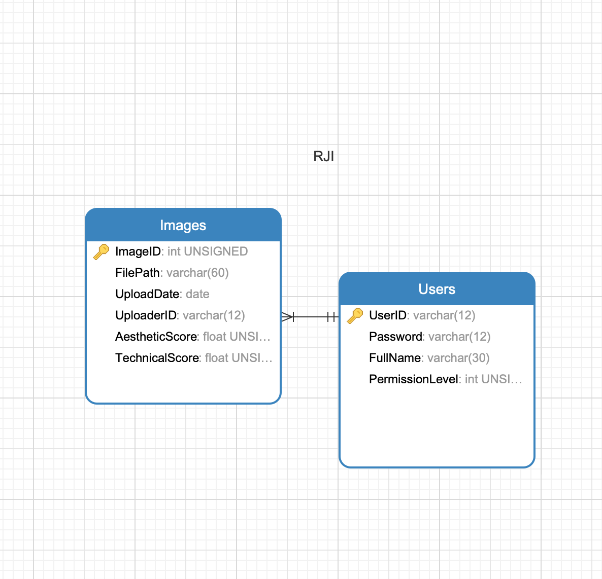

# Sprint 1 Design Document Template

## Deployment Environment

[Link to your deployment environment](http://rji.glike.cf)

## Functional Requirements

1. Use Case Name A
	- Functional Requirement 1
	- Functional Requirement 2
	- ... etc.
2. Use Case Name B		
	- Functional Requirement 1
	- Functional Requirement 2
	- ... etc.
3. ... etc. 

## Database Design

### ERD



### DDL 

```SQL

    CREATE TABLE `Images` (
    `ImageID` int(10) UNSIGNED NOT NULL AUTO_INCREMENT,
    `FilePath` varchar(60) NOT NULL UNIQUE,
    `UploadDate` date NOT NULL,
    `UploaderID` varchar(12) NOT NULL,
    `AestheticScore` float UNSIGNED NULL,
    `TechnicalScore` float UNSIGNED NULL,
    PRIMARY KEY (`ImageID`) 
    );
    CREATE TABLE `Users` (
    `UserID` varchar(12) NOT NULL,
    `Password` varchar(12) NOT NULL,
    `FullName` varchar(30) NULL,
    `PermissionLevel` int(1) UNSIGNED NOT NULL DEFAULT 0,
    PRIMARY KEY (`UserID`) 
    );

    ALTER TABLE `Images` ADD CONSTRAINT `fk_Photo_User_1` FOREIGN KEY (`UploaderID`) REFERENCES `Users` (`UserID`);
    
%% ETC
```    


### User Interface Files

1. first one
2. second one
3. etc.


### Model Files (Database Access)

1. first one
2. second one
3. etc


### Controller Files (API or other)

1. first one 
2. second one
3. etc. 

## Describe languages you need to use, and any gaps in skills on your team. 

1. first language 
    - how you will use examples or learn what you need
2. second language 
    - how you will use examples or learn what you need
3. Skill gaps, if any, otherwise specify who is doing what
    - name
    - name
    - skill gap 

