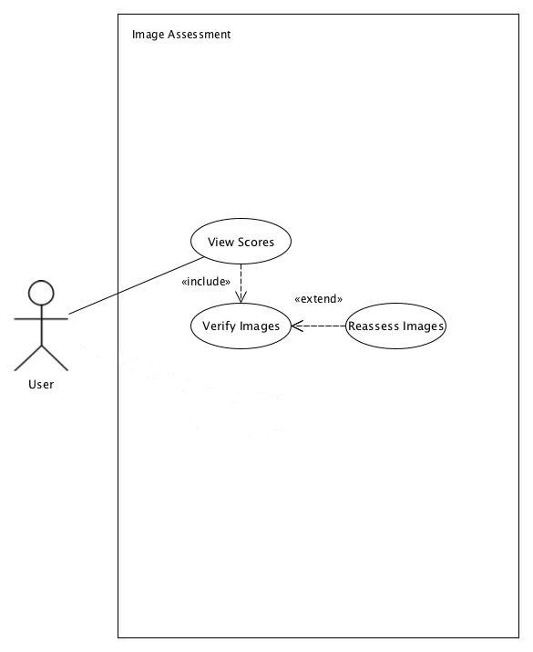
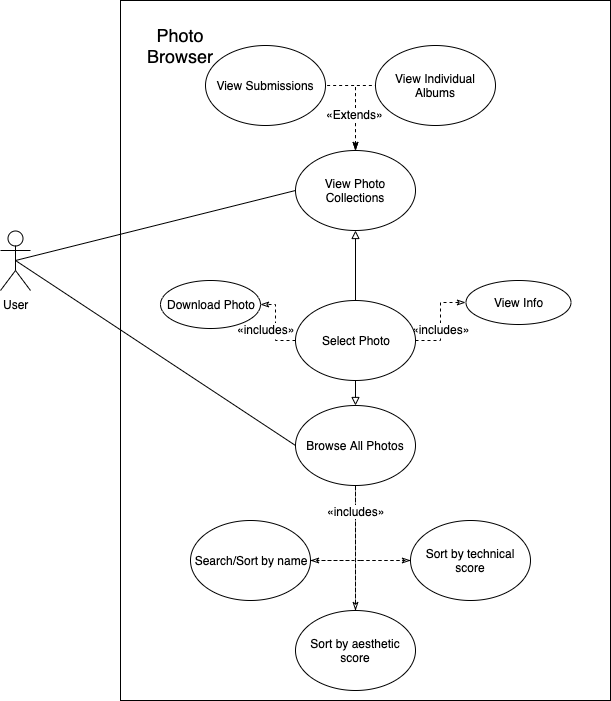

# Sprint 1 Design Document 

## Deployment Environment

[Deployment environment](http://rji.glike.cf)

## Functional Requirements


1. User File Management


- (disclaimer)The User File Management interface has not been fully implemented yet
- Files are currently stored and manipulated through a server using SQL queries implemented in PHP
- Users do not currently have the ability to directly manipulate files

2. Image Assessment	



--Using docker as a base
--Images are scored on upload
--The scores tracked with the image name (along with other attributes

3. Photo Browser



--(Disclaimer) Has not yet been implemented
--Image file information is stored in the database and will eventually be options to be used for sorting/searching
--Image attributes are: TechnicalScore, AestheticScore, UploaderID, ImageID, FilePath, and UploadDate

4. Train Model


--(Disclaimer) Not fully implemented yet
--Using docker as a base
--Seeded with dummy data for testing
--Plans to eventually train assessment algorithm to rank differently depending on category

Current Implementation:

--Implementation is utilizing Amazon AWS for limited interface and storage library
--Set up an image assessment library and seeded it with dummy data to test its capabilities
--Implemented a basic database schema, and have stored our files using the Filestream functionality SQL has. 


## Database Design

### ERD


### DDL 

```SQL

    CREATE TABLE `Images` (
    `ImageID` int(10) UNSIGNED NOT NULL AUTO_INCREMENT,
    `FilePath` varchar(60) NOT NULL UNIQUE,
    `UploadDate` date NOT NULL,
    `UploaderID` varchar(12) NOT NULL,
    `AestheticScore` float UNSIGNED NULL,
    `TechnicalScore` float UNSIGNED NULL,
    PRIMARY KEY (`ImageID`) 
    );
    CREATE TABLE `Users` (
    `UserID` varchar(12) NOT NULL,
    `Password` varchar(12) NOT NULL,
    `FullName` varchar(30) NULL,
    `PermissionLevel` int(1) UNSIGNED NOT NULL DEFAULT 0,
    PRIMARY KEY (`UserID`) 
    );

    ALTER TABLE `Images` ADD CONSTRAINT `fk_Photo_User_1` FOREIGN KEY (`UploaderID`) REFERENCES `Users` (`UserID`);
    
%% ETC
```    


### User Interface Files

[Main Interface](./index.html)


### Model Files (Database Access)

[Model](https://github.com/computationalmystic/RJI-group1/tree/model) 

[SQL](./image_assessment_schema.sql)


### Controller Files (API or other)

[Image Upload](./upload.php)

[Aesthetic Score](./getScoreAesthetic.sh)

[Technical Score](./getScoreTechnical.sh)


## Describe languages you need to use, and any gaps in skills on your team. 

1. Python
    - used with docker as a framework for machine learning based image assessment
2. PHP/CSS/HTML 
    - used as user interface and to communicate with database using mySQL
3. SQL
    - main DDL used to store image data with scores as well as user data
    
4. Language Proficiency
    - Gavin: work with python and docker
    - Chase: database definition, PHP
    - Allan: help with database
    - John: help with docker

